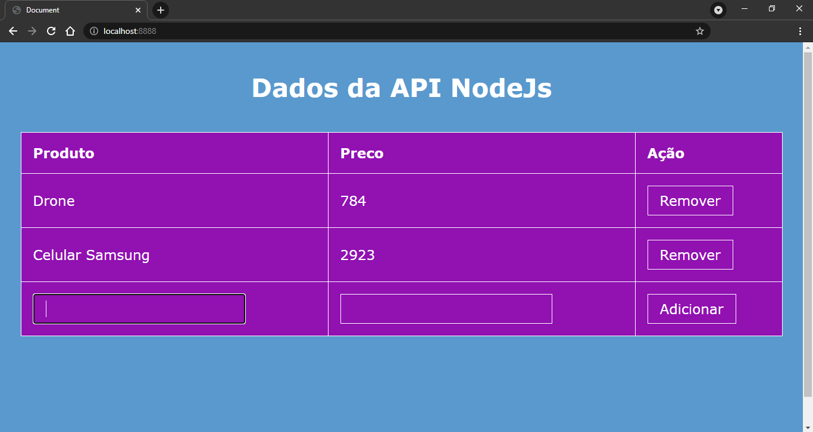
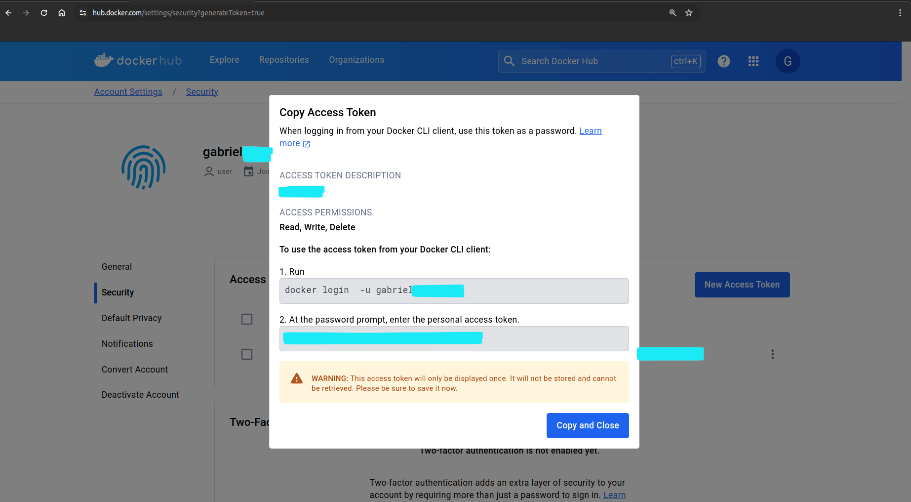

# Docker
Estudos envolvendo a criação de três containers usando docker. A idéia é a criação de um container mysql que armazenará um banco de dados, um container conectado que armazenará uma API nodejs que conecta ao banco de dados e retorna uma lista de itens e por fim um container PHP que conterá um website que busca os dados da API

Imagem do site em PHP rodando em um container, realizando consultas na API NODE em outro container que busca dados outro container com uma imagem do mysql.


O processo todo foi feito pelo Terminal do Windows, mas também tem opções para trabalhar com a interface conforme você pode ver no docker Desktop:


Instale o Doker: https://www.docker.com/products/docker-desktop
Imagens para usar: https://hub.docker.com/_/node


------

# Configurando o Mysql
## Docker file para uma imagem Mysql
```docker
FROM mysql
ENV MYSQL_ROOT_PASSWORD senha_db
```

## Contruindo a imagem  
```shell
docker build -t mysql-image -f .\db\Dockerfile .
```
| flag    |   Descrição                            |
|---------|----------------------------------------|
|  t      |   Nome para a imagem (Nome aleatório)  |
|  f      |   Espcifica o docker file              |
|  .      |   pasta atual para construiri o docker |

## Ver imagens disponível para uso:    
```shell
docker image ls
```

## Criando/executando um container com pasta compartilada     
```shell
docker run -d -v ${PWD}/db/data:/var/lib/mysql --rm --name mysql-container mysql-image
```   
| flag    |   Descrição                            |
|---------|----------------------------------------|
| -d      |   detect => Libera o terminal          |
| -v      |   Pasta Compartilhar:Pasta Container   |
| --rm    |   Remover se já existir                |
| --name  |   Nome do container                    |
|         |   Nome da imagem                       |


## Ver os containers em execução
```shell
docker ps 
```

## Acessar o container      
```shell
docker exec -it mysql-container //bin//bash
```       
| flag    |   Descrição                            |
|---------|----------------------------------------|
| -it     | Acessar o terminal                     |
|         | Container                              |
|         | Local do bash                          |

## Acessar o mysql e ver dados
```shell
mysql -uroot -psenha_db
create database database_db;
ALTER USER 'root' IDENTIFIED WITH mysql_native_password BY 'senha_db';
flush privileges;
exit;
exit
```

# Configurando a API nodejs
## Acesse a pasta api
```shell
npm init
```

```shell
npm install --save-dev nodemon
npm install --save express
npm install --save mysql
```

## Edit o package.json para
```json
"scripts": {
   "start": "nodemon ./src/index"
}
```

## Crie o dockerfile na pasta api/
```dockerfile
FROM node:14-slim
WORKDIR /home/node/app
CMD npm start
```

## Crie a imagem para o node    
```shell
docker build -t node-image -f Dockerfile .
```

## Crie/Execute o container    
```shell
docker run -d -v $pwd/:/home/node/app -p 9001:9001 --link mysql-container --rm --name node-container node-image
```    
| flag    |   Descrição                            |
|---------|----------------------------------------|
| -p      | Porta do local: Porta do container     |
| --link  | Link com o mysql-container             |


## Acesse o localhost para ver a API Node rodando conectado com o container mysql
```text
http://localhost:9001/obter_itens
```


-------------------------------------

# Configurando o PHP
## Contruindo a imagem do php, dockerfile na pasta site:
```dockerfile
FROM php:7.2-apache
WORKDIR /var/www/html
```

## Criando a imagem, va na pasta raiz
```shell
docker build -t php-image -f .\site\Dockerfile .
```

## Criando/executando o container linkado com o node container
```shell
docker run -d -v $pwd/site:/var/www/html -p 8888:80 --link node-container --rm --name php-container php-image
```

## Acessando o site
http://localhost:8888


--------

# outros recursos
## Parar o container
```shell
docker stop nome-container
```

## Faz o container mysql executar o arquivo especificado (No Windows)   
```shell
Get-Content db/script.sql | docker exec -i mysql-container mysql -uroot -psenha_db
```    
| flag    |   Descrição                            |
|---------|----------------------------------------|
| Get..nt |   Código para o docker executar        |
| exec    |   Rodar comandos no container          |
| -i      |   Modo interativo, esperar resposta    |
| --name  | Nome do container                      |
| -p      | Senha do mysql do dockerfile           |


# extras
Realizar build, mostrar o progresso e sem cache
docker compose build --progress=plain --no-cache

docker compose -f docker-compose.yml build
docker compose -f docker-compose.yml up
docker compose -f docker-compose.yml down
docker compose ps


docker compose exec container-name /bin/sh
docker compose exec container-name /bin/bash
docker exec -it container-name bash
docker exec -it container-name /bin/sh
docker logs container-name


===========


Install docker https://www.digitalocean.com/community/tutorials/how-to-install-and-use-docker-on-ubuntu-22-04

Install make https://linuxgenie.net/install-use-make-ubuntu-22-04/

===

# to run docker without sudo in ubuntu 22
sudo groupadd docker
sudo usermod -aG docker $USER
newgrp docker

dockerize --wait tcp://db:3306
docker exec -it app bash

docker compose ps
docker compose up -d


# Entrar em um container ativo com o bash
docker exec -it app2 bash


# Baixar imagem
docker pull ubuntu

# Apagar todos os volumes
docker volume prune

# Executar docker com o name meuubuntuname, deatchment mapeando esse volume e rodando a imagem do ubuntu
docker run --name meuubuntuname -d -v example-volume:/app ubuntu


## mount volume with bind (needs create folder)
docker run --mount type=bind,source=$(pwd)/files,target=/home -it ubuntu bash

# Inspecionar um volune
docker volume inspect meuvolume

# SHow all containers includes stopped containers 

docker ps -a


# o -rm ao finalizar irá remover o container, e não irá mais aparecer no docker ps -a

docker run --rm --name seraremovidoao rodar -d -v example-volume:/app ubuntu 

# Entra em uma imagem do ubuntu totalmente nova no bash. Ao sair tudo se apaga
docker run -it ubuntu bash

# Entra com um volume persistente

docker run --mount type=volume,source=ubt7,target=/src -it ubuntu bash

##  VOLUME DO TIPO BIND no meu local
docker run --mount type=bind,source=$(pwd)/files,target=/src -it ubuntu bash


# Mapeia porta 80 do pc para porta 8080 do container

docker run -p 80:8080 -it ubuntu bash


## COMNADO
mostrar onde estão  echo $(pwd)


# Ver logs de um container ativo

docker logs container_name

# Listar imagens
 docker images


# ========
docker login




# Listar todos os containers, retornando apenas o id 
docker ps -a -q

# Remover todos os containers a força 
docker rm $(docker ps -a -q) -f

# ENTRYPOINT
fica segurando 

# CMD
é um comando, ele roda, não é feito para segurar e pode ser substituido  ao chamar a execução

```dockerfile
FROM ubuntu:latest

ENTRYPOINT [ "echo", "hello"]
CMD [ "world" ]

# docker build -t mycontainer -f ./Dockerfile .
# docker run --rm mycontainer     # hello world
# docker run --rm mycontainer opa # hello opa

```


# Listar redes

docker network ls

# Apagar todas as redes
docker network prune

# Acessar o bash
docker run -it ubuntu bash